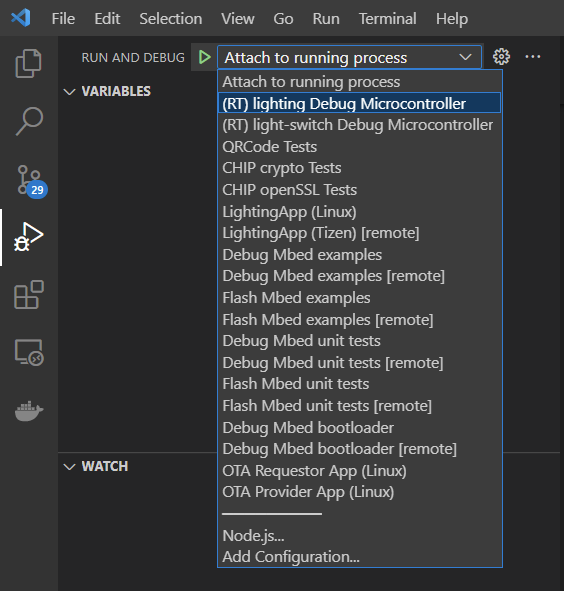

# Rafael matter environment setup for windows
## Prerequest
- SEGGER JLink: [Download](https://www.segger.com/downloads/jlink/) 
- Arm Tool chain: [Download](https://developer.arm.com/downloads/-/arm-gnu-toolchain-downloads)
---
## Setup Configure
- Add Rafael configure file to JLink:
    - Append JLinkDevices.xml and RT58x_1MB.FLM to JLink path (ex:C:\Program Files (x86)\SEGGER\JLink)
- Config VSCode debugger setup (launch.json):
    - JLink setup : replace all "serverpath": "<JLinkGDBServerCL.exe path>" (ex: C:/Program Files (x86)/SEGGER/JLink/JLinkGDBServerCL.exe)
    - Arm Tool chain setup: replace all "armToolchainPath": "<Arm Tool chain bin path>" (ex: C:/Program Files (x86)/Arm GNU Toolchain arm-none-eabi/12.2 mpacbti-bet1/bin)

---
## Start Debugger

